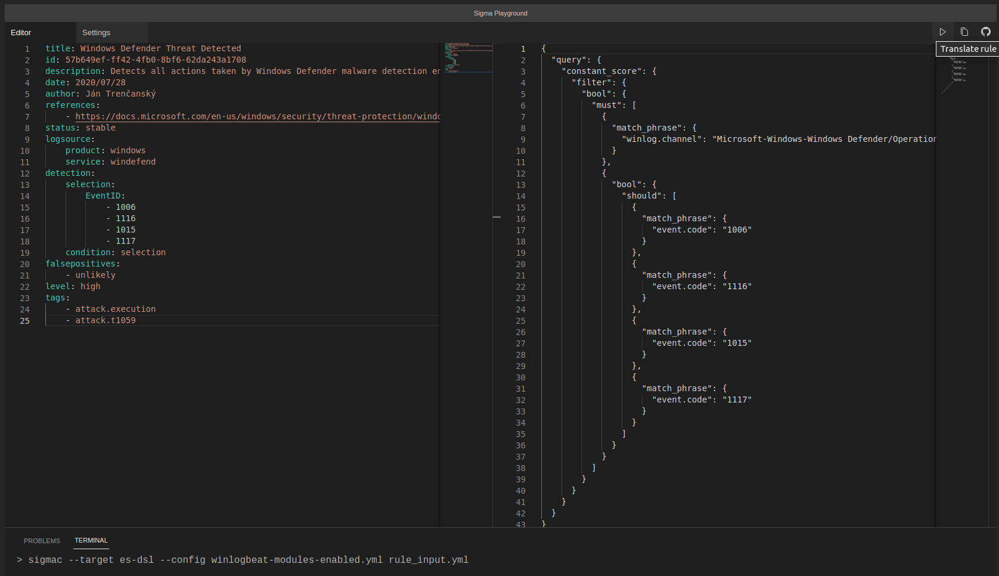

# sigma-playground

Small interactive playground to experiment with the [Sigma](https://github.com/SigmaHQ/sigma) generic rule format and sigmatools converter without the need to install anything.



## How does it work

The playground has three components:

- [Monaco Editor](https://microsoft.github.io/monaco-editor/) (code editor that powers VS Code)
- [Pyodide](https://pyodide.org/en/stable/) (Python distribution for the browser based on WebAssembly)
- [BrowserFS](http://jvilk.com/browserfs/1.4.1/) (An in-browser filesystem that supports various backends)

These three components are ducktaped together in Vue 3 app to create a static site that operates entirely in your browser.

A slightly modified version of sigmatools is installed into Pyodide to get you started on experimenting with Sigma.

None of your work leaves your browser, everything is stored in browser LocalStorage. Internet connection however is required because some components are loaded from CDN.

Used icons are from [vscode-codicons](https://github.com/microsoft/vscode-codicons)

## Why?

When I was doing a [workshop](https://github.com/j91321/sib-workshops/tree/main/sigma) on Sigma for some university students I wanted to show them that different configs and backend options can greatly change the output query. While [uncoder.io](https://uncoder.io/) is a great tool it simplifies the process a bit too much for learning purposes. 

I also wanted to learn a modern JavaScript framework like Vue 3 and needed a learning project.

## Disclaimer

I am in no sense of the word a frontend developer. I think the Vue code is ok, but the CSS it hot garbage and I'm aware of that.

This is work-in-progress. There may be combinations of targets and configs that don't work for various reasons and I am familiar only with some of the backends to test the output. If you encounter any problem that doesn't manifest in sigmatools when used normally please raise an issue.

## Usage

Write Sigma rule in input editor on the left, pick target and config in the Settings tab and hit play. Output should display in the output read-only editor on the right side. 

The bottom of the editor will show you the sigma command you are executing and any Errors/Warnings that may have occurred.

### Monaco Editor tips

You can press F1 to open editor menu. There are a few useful commands added:

- Load Sigma Rule Template - replaces input editor with a Sigma rule template
- Generate GUID also (Ctrl+Alt+g) - generates GUID on cursor 

## Project setup
```
npm install
```

### Compiles and hot-reloads for development
```
npm run serve
```

### Compiles and minifies for production
```
npm run build
```

### Lints and fixes files
```
npm run lint
```

## License

MIT

**except the contents of src/assets/configs and the sigmatools wheel file in public/ these are taken/based on [Sigma project toolchain](https://github.com/SigmaHQ/sigma) and are published under  General Public License.** 